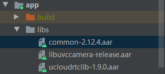
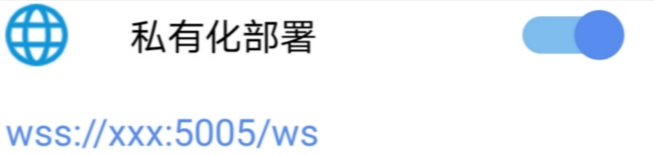

## 1 快速使用

- ### libs

  demo 下的libs有如下库

  

  其中ucloudrtclib-xxx.aar 是urtc 的sdk，xxx为版本号，支持本地和jcenter引用，common-2.12.4.aar，libyuvcamera-release.aar 为辅助验证自定义外部摄像头（例如usb摄像头）的输入功能的，引用方式参考如下：

  ```
      implementation (name: 'ucloudrtclib-2.0.0', ext: 'aar')
      implementation(name: 'libuvccamera-release', ext: 'aar')
      implementation(name: 'common-2.12.4', ext: 'aar')
  //  implementation 'com.ucloud:ucloudrtclib:2.0.0'
  ```

- ### 配置APP_ID&APP_KEY

  demo运行支持 两种token模式，测试模式，正式模式，通过sdk环境变量来控制。

```
//测试模式
UCloudRtcSdkEnv.setSdkMode(UCloudRtcSdkMode.UCLOUD_RTC_SDK_MODE_TRIAL);
//正式模式
UCloudRtcSdkEnv.setSdkMode(UCloudRtcSdkMode.UCLOUD_RTC_SDK_MODE_NORMAL);
```

​      测试模式下适合快速浏览开发 demo功能，此模式下引用的 sdk 根据APP_ID & APP_KEY 自动生成 测试token，因此运行在测试模式下的话需要先配置下com.urtcdemo.utils.CommonUtils.java 文件中 APP_ID & APP_KEY 字段。

```
public static final String APP_ID = "";
public static final String APP_KEY = "";
```

​      APP_ID & APP_KEY 字段的获取请参考[开通URTC服务](https://docs.ucloud.cn/urtc/quick)。

​      测试模式下在APP端储存APPKEY，出于安全性的考虑并不保险，正式模式下的 token 一般由sdk使用方的 业务 服务端生成，生成算法请参考[Token生成指导](https://docs.ucloud.cn/urtc/sdk/token)


- ### 公有云和私有云

  秉承ucloud的中立性特色，urtc 可支持公有云亦可支持私有云部署。

  两种方式可以在demo 中调整公有云或者私有云的设置，请选择一个，不要都打开。

  方式1：com.urtcdemo.Application.UCloudRtcApplication init方法，xxx 为私有云rtc服务器域名或者ip地址

~~~
//        UCloudRtcSdkEnv.setPrivateDeploy(true);
//        UCloudRtcSdkEnv.setPrivateDeployRoomURL("wss://xxx:5005/ws");
~~~
​	方式2：在app启动页面齿轮齿点击进入设置页面并打开私有化部署填入地址




- ### 编译运行

  编译完apk运行即可，初次运行需要赋予相应的存储，摄像头，录音权限。

  用户ID,房间号可随意填写，用户ID选填，房间号必填。

  执行完上述所有步骤后输入任意房间号点击加入房间即可体验demo。


## 2 描述
URTCAndroid 是UCloud推出的一款适用于android平台的实时音视频 SDK，支持android5.0及以上系统，提供了音视频通话基础功能，提供灵活的接口，支持高度定制以及二次开发。


## 3 基本功能
* 支持公有云和私有云部署

* 基本的音视频通话功能	

* 支持内置音视频采集的常见功能	

* 支持静音关闭视频功能	

* 支持视频尺寸的配置(180P - 720P)	

* 支持自动重连	

* 支持纯音频互动	

* 支持视频的大小窗口切换	

* 支持获取视频房间统计信息（帧率、码率、丢包率等）	

* 支持编码镜像功能		

* 支持屏幕录制功能

* 支持自动手动订阅 自动手动发布

* 支持权限（上行/下行/全部）控制

* 支持音量提示

* 支持获取sdk版本

* 支持大班小班切换功能

* 自定义的外部输入和输出扩展接口


## 4 版本与支持

- sdk 目前更新至版本2.0.0

- 支持Android api 16 ~ 29

- 支持架构 "armeabi-v7a", "arm64-v8a", "x86", "x86_64"


## 5 文档索引

* sdk通用功能使用请参考[URTC SDK集成指南](https://docs.ucloud.cn/urtc/sdk/index)

* android api 文档 请参考随 demo 所附 的ucloud_rtc_android_api_xxx.zip  javadoc文档，xxx 代表sdk版本号或者

* 对于urtc 一些常见术语，概念的解释亦可参考demo 所附URTC Android_master.docx 文档
